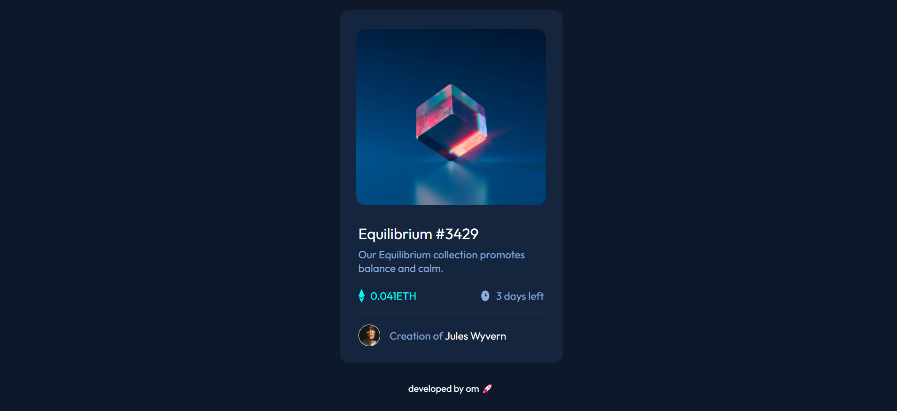

NFT preview card component

This is a solution to the [NFT preview card component challenge on Frontend Mentor](https://www.frontendmentor.io/challenges/nft-preview-card-component-SbdUL_w0U).

## Screenshot

## Table of contents

- [Overview](#overview)
  - [The challenge](#the-challenge)
  - [Links](#links)
- [My process](#my-process)
  - [Built with](#built-with)
  - [What I learned](#what-i-learned)
- [Author](#author)

## Overview

### The challenge

Users should be able to:

- View the optimal layout depending on their device's screen size
- See hover states for interactive elements

### Links

- Solution URL: [Add solution URL here](https://your-solution-url.com)
- Live Site URL: [Add live site URL here](https://your-live-site-url.com)

## My Process

### Built with

- Semantic HTML5 markup
- CSS custom properties
- Flexbox
- CSS Grid
- Mobile-first workflow

### What I learned

While doing this challenge I learnt how to make a responsive website for all device sizes using media queries, I used relative units for margins, paddings and font sizes as it helps in developing responsive website.

## Author

- Website - [Om Gaikwad](https://omgaikwad.netlify.com/)
- Frontend Mentor - [@omgaikwad](https://www.frontendmentor.io/profile/omgaikwad)
- Twitter - [@OmGaikwad](https://twitter.com/OmGaikwad_)
